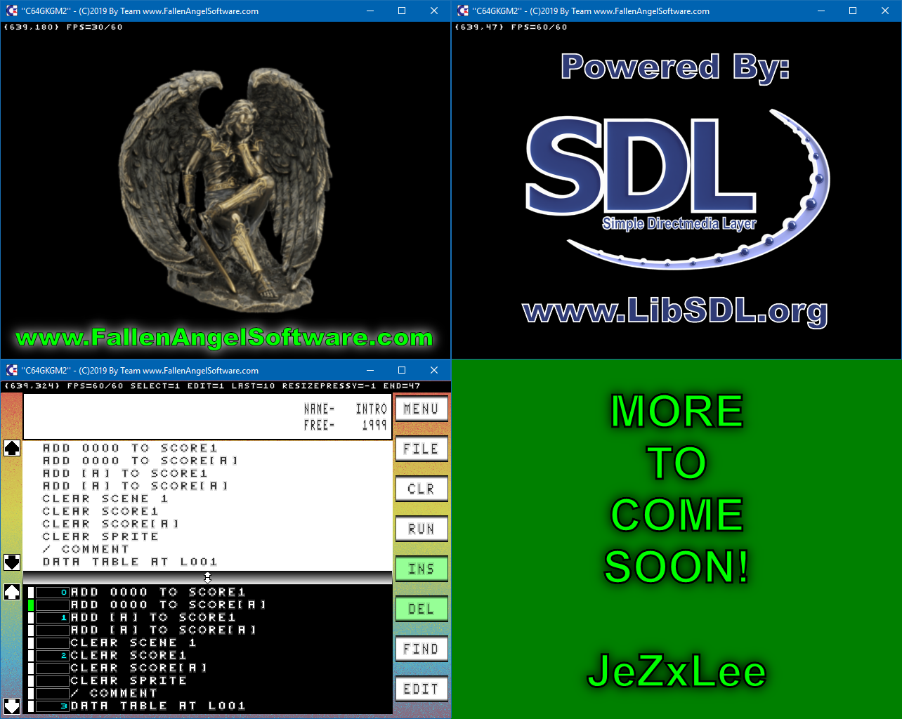

# SDL2-C64GKGM2
100% FREE Cross-Platform Open-Source SDL2 Video Game Creation I.D.E.!  
(straight up SDL2 with no support libs)  
  
Windows®/Linux desktops & notebooks  
(makefile included for easy building on any Linux)  
  
STATUS: "Pre-Alpha"  

- Code Editor: 50%+ completed  
(clear/delete/insert 100%)  
(find 100%)  
(edit delete/move/copy 100%)  
(code windows resize 100%)  
- Sprite Editor; 0% completed(started)  
- Scene Editor: 0% completed(doable)  
- Sound Editor: 0% completed(no idea)  
- Song Editor: 0 % completed(no idea)  
  
More to come...  
  
JeZxLee  
www.FallenAngelSoftware.com  

